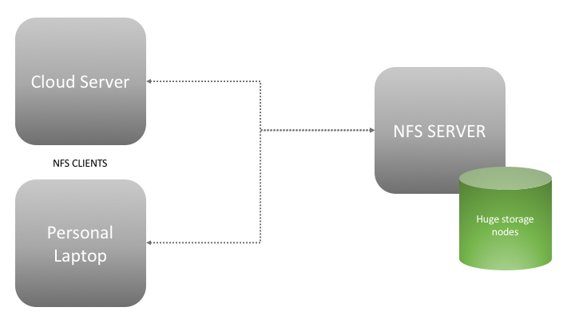

# Set up an NFS server easily !

[NFS](https://help.ubuntu.com/lts/serverguide/network-file-system.html) is a very handy tool to mount network drives into local compute nodes. Let us define a problem statement and try to use NFS to mitigate our issues.

## Scenario:
Our local storage is limitted. Both the cloud instance I have access to and my local machine have limitted storage. 
My big-data scale problem cannot be run in either of these.
We have a couple of storage servers with TB's of storage. The big question is, how to mount these drives into our local machine or cloud servers. That is where NFS comes into play.




NFS allows us to mount the network storage as a drive in to the local filesystem. The requirement is to install `nfs-kernel-server` in both the devices and configure them properly.
For easiness, let us fix some IP addesses for the cloud instance and laptop.

- Cloud Instance: 10.0.0.1
- Laptop: 10.0.0.101

## Let us configure the nodes. This works great on Ubuntu 16.04:

**On the NFS Server**:
First, update the packages and install `nfs-kernel-server`.
```
sudo apt update
sudo apt-get install nfs-kernel-server
```
The `/etc/exports` holds NFS configuration. Add a line similar to the one below. Example for NFSv2 and NFSv3:
```
sudo vi /etc/exports
```
```
add this -->
/folder/folder-to-share       hostname1(rw,sync,no_subtree_check) hostname2(ro,sync,no_subtree_check)
```
`/folder/folder-to-share` is the folder to share, hostname 1 and 2 denote the hostname/IP address of the local systems. A comprehensive man page for `exports` is available [here](https://linux.die.net/man/5/exports).

It is a good practice to make sure that the folder that you are sharing has the correct ownership. If not, you can change the ownership using:
```
sudo chown username:groupname -R /folder/folder-to-share
```
The IP addess of local machine can be found using `ifconfig`. If a password is not set, set is using `sudo passwd $USER`.
Before starting the NFS service, we should load the changes that we just made to the `exports` file. For that, run:
```
sudo exportfs -a
```
Finally, restart/start the NFS services. Type the password is asked.
```
systemctl enable rpcbind && systemctl start rpcbind
systemctl enable nfs-server && systemctl start nfs-server
```

**On the NFS Clients**:
Install `nfs-common` by running:
```
sudo apt-get install nfs-common
```
We need to create a folder to mount the device to.
```
mkdir -p /nfs/mountfolder
```
Make sure you have correct ownership for this folder too:
```
sudo chown username:groupname -R /nfs/mountfolder
```
Mount the device to the local folder.
```
sudo mount --verbose hostname1_or_IP:/folder/folder-to-share /nfs/mountfolder
```

Done !

Confirm the working by creating a new file in the network drive:
```
touch /nfs/mountfolder/test.txt
ls /nfs/mountfolder/
```
