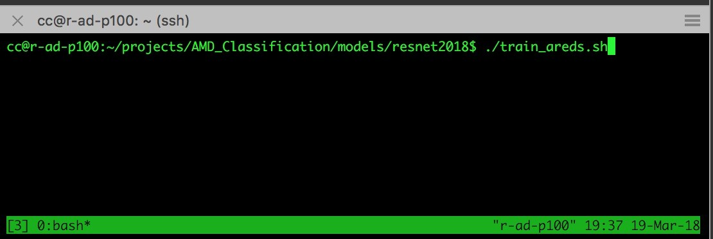
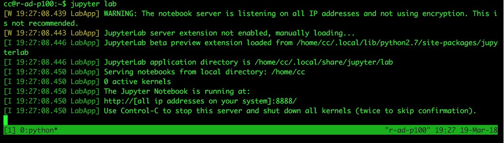
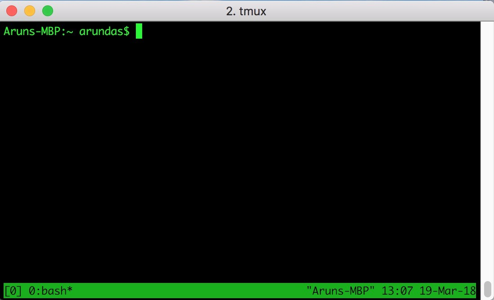
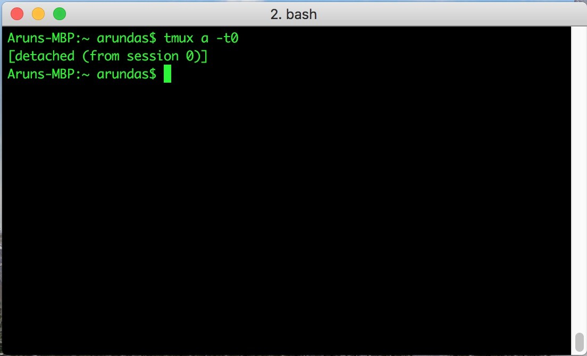
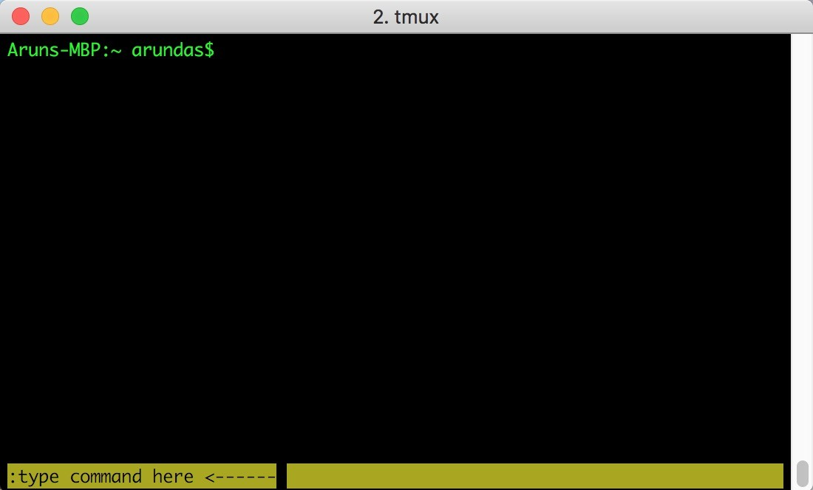
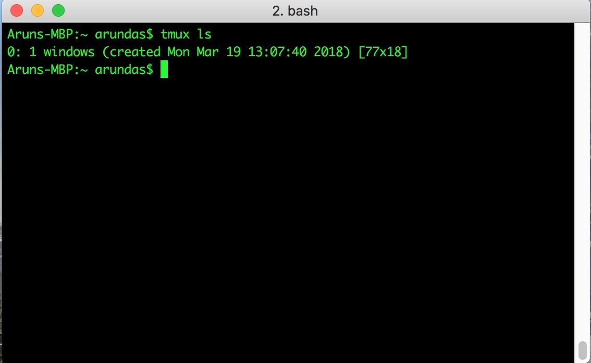

# How I run my days-long scripts without breaking them.
Shared in LinkedIn (https://www.linkedin.com/pulse/how-i-run-days-long-scripts-without-breaking-them-arun-das/)

In the summer of 2015 when I started my masters studies, cloud computing for me was SaaS, IaaS and PaaS working together to support products such as Google Drive. 
Later I realized that big telcos are using the same for entirely different purposes and that AWS is making the big moves in the cloud computing market. 
When my artificial intelligence research gained momentum, our academic cloud resources were the only option to train deep neural networks in considerably lesser amount of time (I trained nets in my laptop and CPU based servers and that took a long, long time). 
Our cloud ran Ubuntu Server without displays and I used to SSH into the cloud instances for writing scripts and running them. 
As the research matured, so did the time required to train these huge neural networks. 
When it takes hours or even days to train a neural net, you don't want your laptop powered on during the entire time maintaining an SSH connection. 
Initially I used to do exactly that - leave laptop in lab and run the script indefinitely till the neural network training converges.

When I proposed my Masters Thesis 'Open Cloud Deep-Learning Architecture For Big Data Analytics and Real-Time Applications', one of the primary concern was on benchmarking deep learning applications on cloud resources. 
It was around that time I learned about terminal multiplexer a.k.a TMUX. 
TMUX allows creation of detachable terminal sessions (tmux windows) in the host systems which allows the terminal sessions to continue to run, even when the SSH session breaks/stops. 
This means, if you run your scripts in a tmux session, then the script continues to run even if the SSH session is broken. 
You can reattach to the tmux session and your script will still be running (or finished). 
You could even create many different tmux window panes and tile them in one terminal running several programs in them.

## Personal Use Cases:

1. Running days-long scripts in the background.

Suppose you have a bash script train_areds.sh which runs several python scripts to train neural networks of different depth on different batch sizes. 
For example, the contents of train_areds.sh could be like the following:

```
#!/bin/bash
python train_resnet.py --depth 18 --batch-size 512
python train_resnet.py --depth 34 --batch-size 400
python train_resnet.py --depth 50 --batch-size 200
python train_resnet.py --depth 101 --batch-size 128
python train_resnet.py --depth 152 --batch-size 100
python train_resnet.py --depth 200 --batch-size 100
```
This script will take a few days to complete on a system with two 16GB NVIDIA P100 GPUs running CUDA 9.0 with CuDNN drivers. 
To run this script by SSH-ing to the cloud instance would be a terrible idea since small issues such as network or power outages can break the SSH session and your script. 
Hence, one of the best ways that I now know is to run the script in a tmux session. 
You could later detach from the tmux session and continue with your work, close the SSH session and come back at a later time to SSH in to the server, attach back to the tmux session and check the progress.


2. Running Jupyter Notebook indefinitely without dropping connection.

If you use Jupyter Notebook regularly then you know that Jupyter needs to be launched in every new session and will close if the SSH connection drops. 
Also, if you have experience working on the cloud, then you know that you should run Jupyter notebook in a new SSH session every time you log in to the cloud. 
TMUX can help save the trouble by indefinitely running Jupyter Notebook in the persistent tmux session. 
One potential flaw is that wrongly configured Jupyter Notebook invites all sort of security issues leading to loss of data or hackers gaining access to your system. 
Therefore, I strongly recommend setting a long alphanumeric password while running Jupyter Notebook indefinitely in the cloud. I've written a tutorial on how to set up Jupyter Notebooks in my GitHub.



## Installing TMUX.

TMUX is installed by default on most recent Ubuntu distributions. 
If you are using a Mac, tmux is not usually present and you need to install it. 
Please follow the steps below:

```
# In Ubuntu
sudo apt-get install tmux

# In Mac
# Easiest way is to install using HomeBrew.
brew install tmux

# In Mac, if you don't have homebrew installed, 
# install it using the following commented line:
# /usr/bin/ruby -e "$(curl -fsSL https://raw.githubusercontent.com/Homebrew/install/master/install)" 
```

## Launching a TMUX session.

Launching a tmux session is as easy as opening the terminal and executing `tmux` command. 
Just type tmux and press Enter. 
You'll be greeted with a tmux window with a number enclosed in square brackets in the lower left hand corner. 
That number is your tmux window ID. 
When attaching back to tmux windows, we pass that ID to attach to the right window.



Once in a tmux session, tmux commands are preceded by a key combination. 
The default prefix in tmux is a press and release of *ctrl + b* (control + b in Mac). 
After running your script, to detach from a session, you can press ctrl + b release the keys and then press the key d to detach.

```
# To Detach from a session
# prefix is press and release of ctrl + b (ctrl and b).
prefix d
```


You could also press ctrl + b and then : (colon) to get a shell to type commands such as detach.


To attach back to a tmux session, you should type the window number (target session) along with the tmux attach-session command from your terminal. 
The new command will be: tmux attach-session -t<windowID>. 
In the current example, the window ID is 0. 
Hence, the command becomes, tmux attach-session -t0. 
Also, we could shorten the command by typing:
```
# To attach to the window 0

tmux a -t0
```
You'll see that your scripts are still running fine in the tmux session, hurray! 
Now, if you need to see a list of all available tmux sessions you've opened, simply execute:
```
tmux ls
```


Now you know the basics of tmux! Hope this was of help!

Until next time, *ctrl + b* d.
